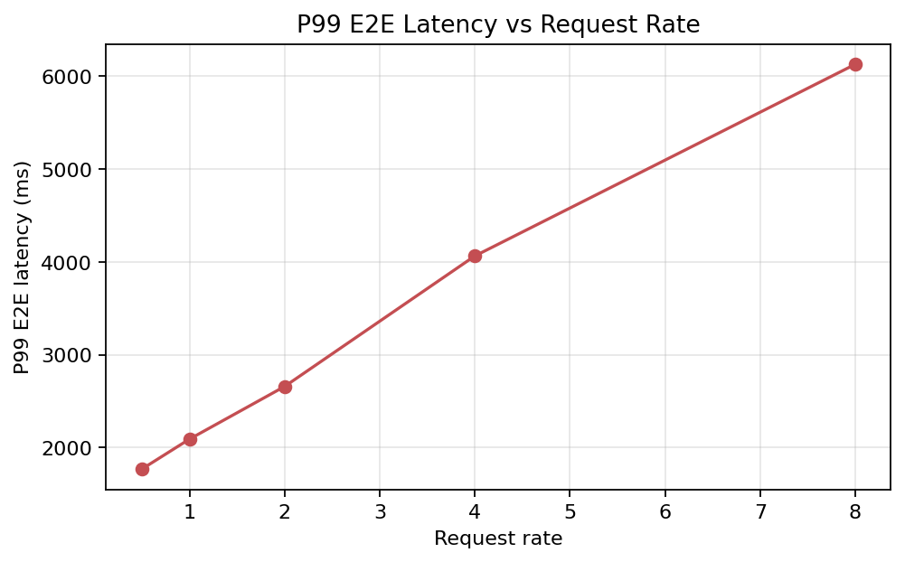

# 项目A-v2：SGLang 4 卡 Qwen3-14B 推理服务压测

在 `4 x RTX 4090 24GB` 上使用 SGLang 单实例 `tp=4` 部署 `Qwen3-14B`，围绕 `/v1/chat/completions` 完成 request-rate、max-concurrency、长 prompt、长输出、shared-prefix、混合流量和长时稳定性压测。

## 环境

| 项 | 配置 |
|---|---|
| 推理框架 | SGLang |
| 模型 | `Qwen3-14B` |
| GPU | `4 x NVIDIA GeForce RTX 4090 24GB` |
| 服务形态 | 单实例 `tp=4` |
| dtype | bf16 |
| 主接口 | `/v1/chat/completions` |

## 核心结果

| 场景 | 结果 |
|---|---|
| rr4 基线 | `3.80 req/s / 486.87 output tok/s`，p99 E2E `4.06s` |
| rr8 基线 | `6.20 req/s / 793.28 output tok/s`，p99 E2E `6.13s` |
| 30 分钟稳定性 | `7200/7200` 成功，p99 TTFT `432.90ms` |
| 15 分钟高压 | `7200/7200` 成功，但 p99 E2E `20.76s` |
| shared-prefix | output throughput 从 `466.28` 提升到 `520.66 tok/s` |
| cache 证据 | cache hit token ratio 从 `0.0023` 提升到 `0.5818` |

## 图表





## 仓库内容

- [复现说明](项目A-复现说明.md)
- [Quickstart](QUICKSTART.md)
- [最终结果文档](项目A-v2-最终结果文档.md)
- [可视化说明](项目A-v2-可视化说明.md)
- [License](LICENSE)
- [GitHub Pages 页面](docs/index.md)

## 结构

```text
.
├─ README.md
├─ LICENSE
├─ QUICKSTART.md
├─ docs/                  # GitHub Pages 展示页
├─ figures/final/         # 最终图表
├─ scripts/               # benchmark 与绘图脚本
├─ 项目A-复现说明.md
├─ 项目A-v2-最终结果文档.md
└─ 项目A-v2-可视化说明.md
```
