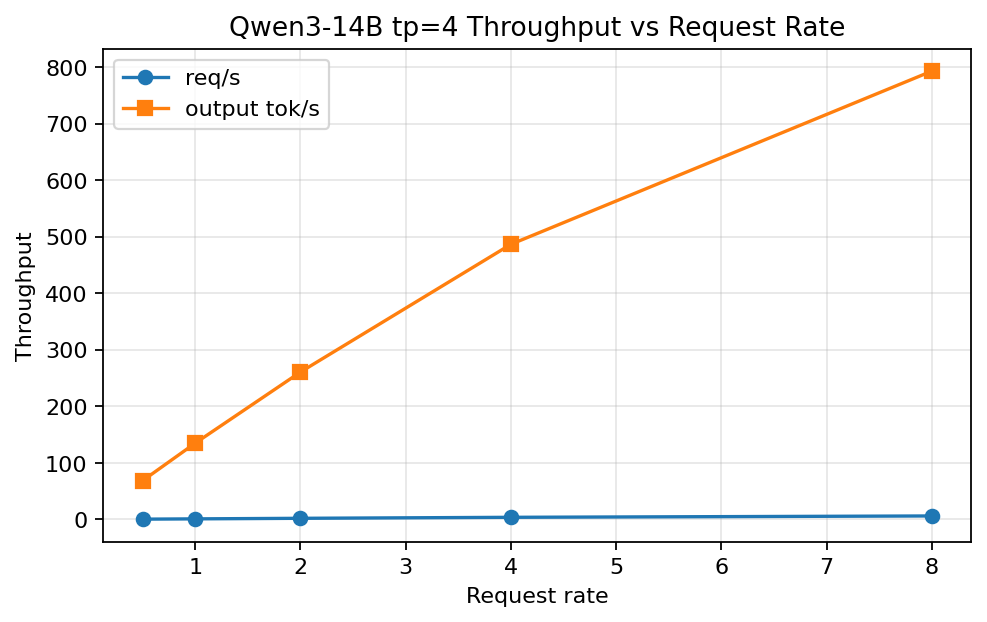
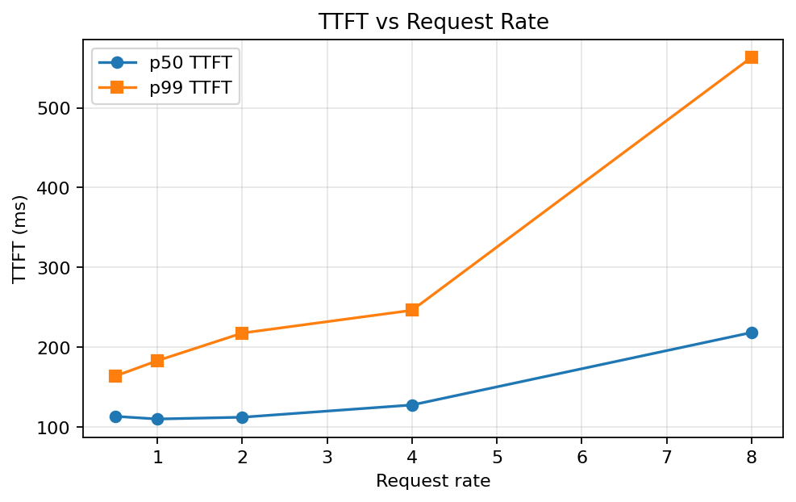
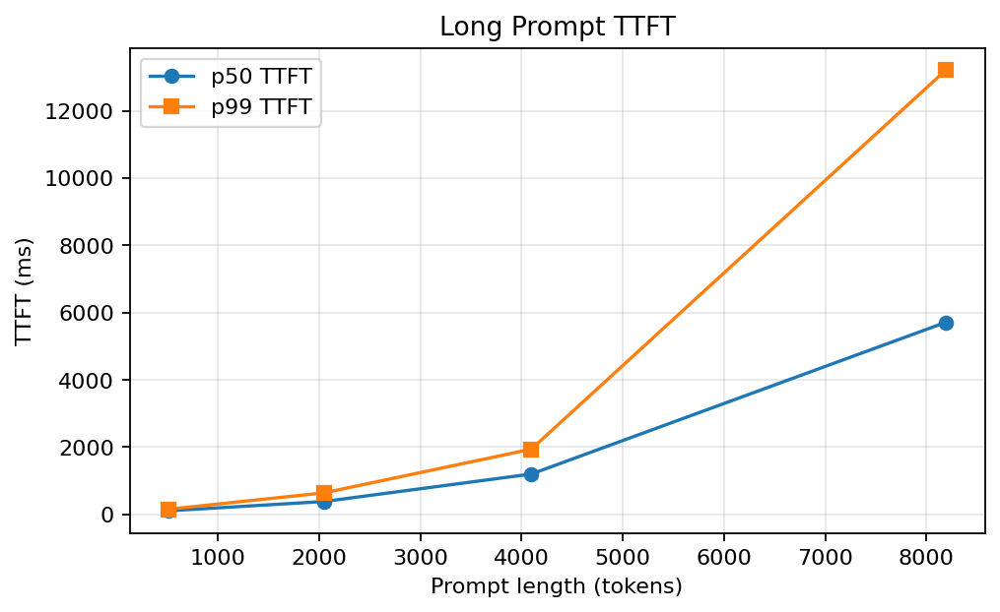
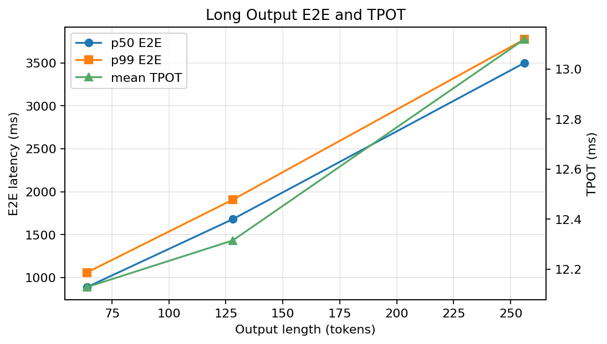
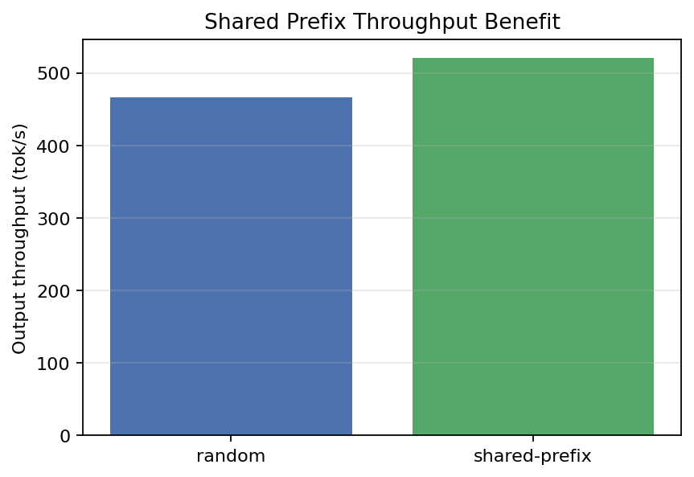
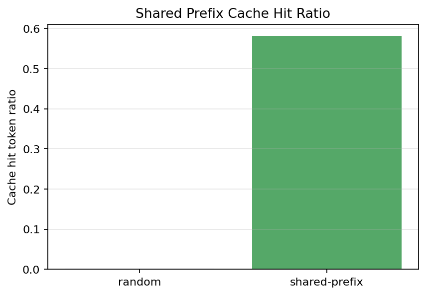
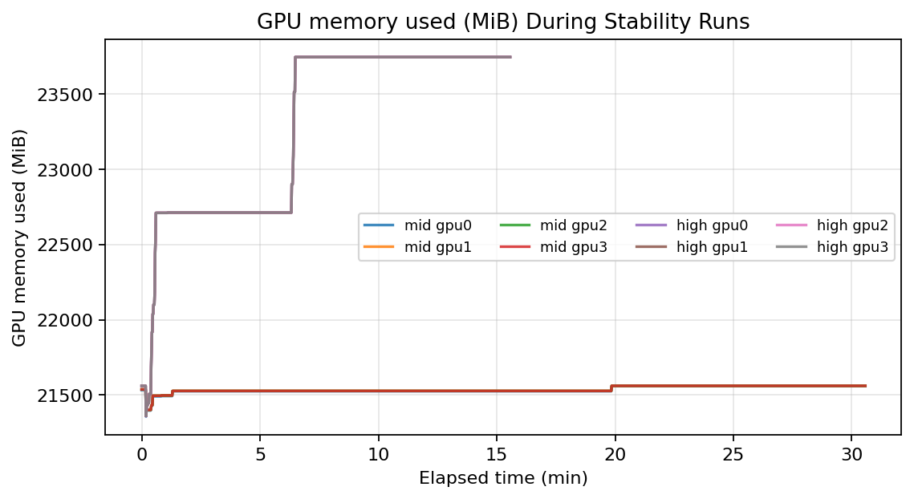
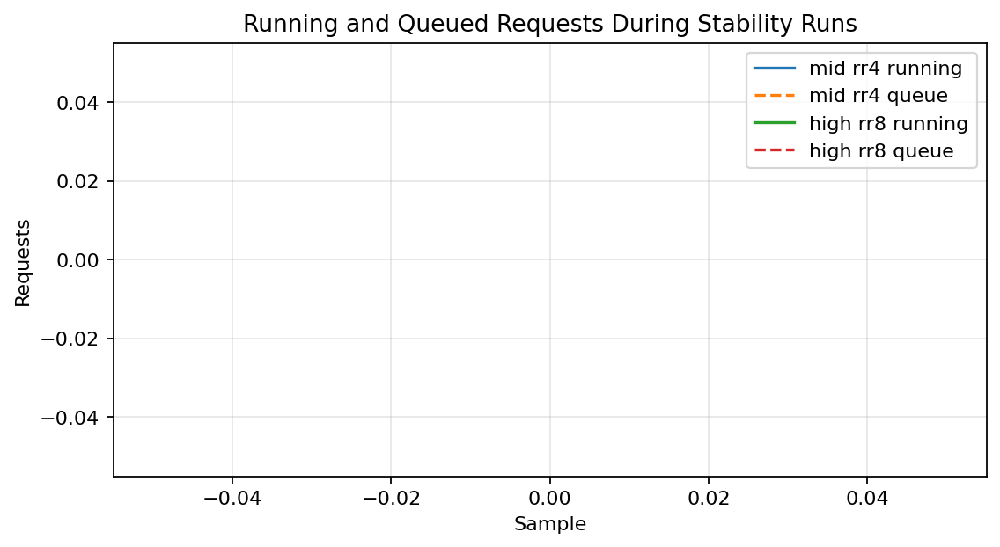

# sglang-performance-test

## SGLang 4 卡 Qwen3-14B 推理服务压测

在 `4 x RTX 4090 24GB` 上使用 SGLang 单实例 `tp=4` 部署 `Qwen3-14B`，围绕 `/v1/chat/completions` 完成 request-rate、max-concurrency、长 prompt、长输出、shared-prefix、混合流量和长时稳定性分析。

## 核心结论

- `rr4` 可作为中压稳定区分析
- `rr8` 进入高压退化区
- 长 prompt 主要拉高 `TTFT`
- 长输出主要拉高 `E2E latency`
- shared-prefix 收益可由 `cached_tokens` 与 `cache_hit_token_ratio` 解释

## 核心数字

| 场景 | 结果 |
|---|---|
| rr4 基线 | `3.80 req/s / 486.87 output tok/s` |
| rr8 基线 | `6.20 req/s / 793.28 output tok/s` |
| 30 分钟稳定性 | `7200/7200` 成功，p99 TTFT `432.90ms` |
| 15 分钟高压 | `7200/7200` 成功，但 p99 E2E `20.76s` |
| shared-prefix | cache hit token ratio `0.5818` |
| random 对照 | cache hit token ratio `0.0023` |

## 图表

### 容量与时延

### 长 prompt / 长输出

### Prefix Cache

### 稳定性

## 说明

- 复现方式见仓库根目录 `sglang-performance-test-reproduction.md`
- 最终结论见仓库根目录 `sglang-performance-test-final-report.md`
- 图表来源说明见仓库根目录 `sglang-performance-test-visualization.md`
